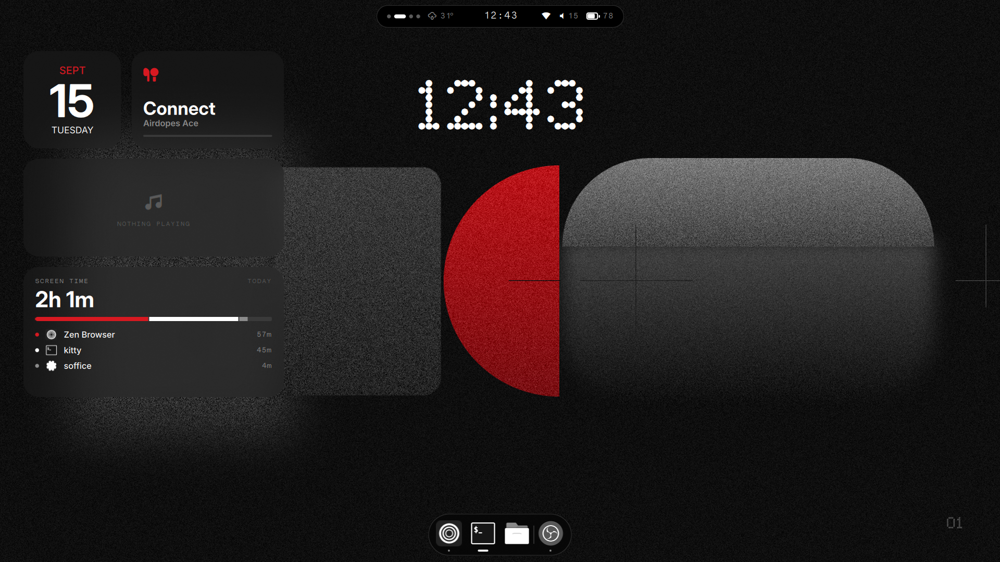

# Nothing OS dotfiles for Hyprland

A desktop that looks like [Nothing OS](https://nothing.tech), built on Fedora 44 + Hyprland with a
custom [Quickshell](https://quickshell.org) shell. Black surfaces, white text, one red accent
(`#D71921`), dot-matrix clocks, monochrome icons, and generated grainy geometric wallpapers.

The base install is [JaKooLit's Hyprland-Dots](https://github.com/JaKooLit/Hyprland-Dots); everything
here layers on top of it. Only four upstream files are touched, and those changes ship as patches.



## What is in here

| Part | Path | Notes |
| --- | --- | --- |
| **Shell** (bar, control center, dock, desktop widgets, OSD, power menu) | `config/quickshell/nothing/` | Quickshell, ~45 QML files. `qs -c nothing`. |
| Hyprland user config | `config/hypr/UserConfigs/` | decorations, Nothing motion curves, keybinds, layer rules, env |
| Hyprland scripts | `config/hypr/UserScripts/` | wallpaper generator + per-monitor apply, media-key OSD, idle suspend, overview toggle |
| Idle / lock | `config/hypr/hypridle.conf`, `hyprlock.conf` | dim 5 min, lock 10, screens off 11, suspend 30 (on battery only); Ndot lock clock |
| Launcher | `config/rofi/` | `nothing.rasi` list theme + `nothing-grid.rasi` 6x3 app grid (Super+D) |
| Notifications | `config/swaync/style.css` | overrides swaync's stock CSS variables |
| Terminal | `config/kitty/`, `config/starship.toml`, `config/fastfetch/`, `config/btop/`, `config/yazi/` | Lettera Mono, dot prompt, dot-matrix fetch logo, monochrome btop / yazi |
| GTK / Qt | `config/gtk-3.0`, `gtk-4.0`, `Kvantum/Nothing`, `qt6ct`, `qt5ct` | adw-gtk3-dark + libadwaita colours, Kvantum theme, Qt colour scheme |
| Static palette | `config/wallust/templates/` | wallust templates with fixed hex values, so KooL's wallpaper scripts keep writing the Nothing palette |
| Icon theme generator | `local/bin/nothing-mono-icons.py` | builds a greyscale copy of any icon theme (`Nothing-Mono`) |
| Wallpapers | `wallpapers/`, `config/hypr/UserScripts/NothingWallpaper.py` | 5 compositions x dark/light at 1080p; generator renders any size |
| Boot chain | `boot/` | SDDM greeter theme (QML), Plymouth script theme, hidden GRUB menu, `install.sh` (sudo) |
| Apps | `apps/` | Zen browser userChrome, Obsidian CSS snippet, Chrome theme pack, Spotify (spicetify) theme in `config/spicetify` |
| Upstream patches | `patches/` | the four JaKooLit files that had to change, as diffs |
| Shell rc | `shell/zshrc-nothing.zsh` | starship + fastfetch lines for `.zshrc` |

## Requirements

Tested on Fedora 44, Hyprland 0.55, Quickshell 0.3.1 (git), Qt 6.11.

- JaKooLit Hyprland-Dots (v2.3.19 or newer) already installed
- `quickshell` (the COPR `quickshell-git` build; the packaged 0.3.0 crashed after Qt 6.11)
- `hypridle`, `hyprlock`, `hyprsunset`, `swww`, `rofi` (2.x), `swaync`, `kitty`, `wallust`
- `brightnessctl`, `wireplumber` (`wpctl`), `pavucontrol`, `blueman`, `nvtop` (GPU % in the stats card)
- `python3-pillow` (wallpapers, icons, fetch logo), `starship`, `fastfetch`, `btop`, `yazi`
- `kvantum`, `qt6ct`, `qt5ct`, [adw-gtk3](https://github.com/lassekongo83/adw-gtk3) (in `~/.local/share/themes` or system-wide)
- Cursor `Bibata-Modern-Ice`, base icon theme `Flat-Remix-Blue-Dark` (any theme works as the input to the generator)

### Fonts (not included)

The look depends on fonts this repo cannot redistribute. Install them to `~/.local/share/fonts/` and run `fc-cache`:

| Family | Used for | Source |
| --- | --- | --- |
| Ndot 57, Ndot57Caps | clocks, big numerals, dot-matrix words | Nothing's brand font; community packaging at [xeji01/nothingfont](https://github.com/xeji01/nothingfont) |
| NType 82 | widget numerals (it is a serif) | same |
| Lettera Mono LL | all UI labels, terminal | commercial (Lineto); also in the repo above |
| Adwaita Sans | GTK/Qt UI font, widget headlines | Fedora package `adwaita-fonts` |
| JetBrainsMono Nerd Font | glyph icons | [nerdfonts.com](https://www.nerdfonts.com) |
| New York Extra Large | calendar numeral (optional) | Apple |

Pango gotcha: a family name ending in a number is parsed as a size, so configs write `Ndot 57,` with a trailing comma.

## Install

```sh
git clone https://github.com/uzayr-iqbal-hamid/nothing-dotfiles ~/nothing-dotfiles
cd ~/nothing-dotfiles
./install.sh          # copies configs into ~/.config (backs up what it replaces), scripts to ~/.local/bin, wallpapers to ~/Pictures
./patches/apply.sh    # patches the four JaKooLit vendor files
```

Then:

1. **Icons**: `nothing-mono-icons.py` builds `~/.icons/Nothing-Mono` from `~/.icons/Flat-Remix-Blue-Dark` (about a minute, 50 MB). Re-run after installing apps so their icons get greyed too.
2. **gsettings**:
   ```sh
   gsettings set org.gnome.desktop.interface gtk-theme adw-gtk3-dark
   gsettings set org.gnome.desktop.interface icon-theme Nothing-Mono
   gsettings set org.gnome.desktop.interface font-name 'Adwaita Sans 11'
   gsettings set org.gnome.desktop.interface monospace-font-name 'Lettera Mono LL 11'
   gsettings set org.gnome.desktop.interface cursor-theme Bibata-Modern-Ice
   gsettings set org.gnome.desktop.interface cursor-size 24
   ```
3. **Flatpaks** see the GTK theme and icons through overrides (Fedora's runtimes have no Gtk3theme extension point):
   ```sh
   flatpak override --user --filesystem=xdg-config/gtk-3.0:ro --filesystem=xdg-config/gtk-4.0:ro \
     --filesystem=~/.icons:ro --filesystem=~/.themes:ro --filesystem=~/.local/share/themes:ro
   ```
4. **Wallpapers**: `NothingWallpaperApply.sh dark` sets one composition per monitor (edit the output names at the top of the script). Render other sizes with `NothingWallpaper.py --size 2560x1440 --mode both`.
5. **Shell rc**: append `shell/zshrc-nothing.zsh` to `~/.zshrc` (or source it).
6. Reload Hyprland (`hyprctl reload`) and start the shell: `qs -c nothing`. It autostarts from `UserConfigs/Startup_Apps.conf` on the next login.

`install.sh --dry-run` prints what would be copied without touching anything.

## The shell

`config/quickshell/nothing/` is a flat directory of QML files; `shell.qml` is the entry point, `Theme.qml`
holds every colour, font, radius and timing, and `Config.qml` holds user settings (clock format,
weather location, which output gets the widgets and the dock, OSD timing, backlight device, click actions).

- **Bar**: floating black pill per monitor. Workspace dots, weather chip (Open-Meteo, located by IP unless you set lat/lon in `Config.qml`), clock, network, volume, battery. Click the clock for the control center.
- **Control center**: Ndot clock, network / bluetooth tiles, volume, media card with waveform and album tint, night light (hyprsunset), CPU / RAM / GPU / temp, caffeine (idle inhibitor), lock / power / notifications.
- **Desktop widgets** (laptop screen, under windows): calendar tile, bluetooth tile, media, screen time (tracked by the shell itself, saved daily).
- **Dock**: auto-hide bottom pill with monochrome icons; shows on empty workspaces or when the pointer dwells on the bottom edge. Right-click to pin / unpin.
- **OSD**: dot-matrix volume / mic / brightness pill; media keys are rebound to `UserScripts/Volume.sh` and `Brightness.sh`.
- **Power menu**: fullscreen, Ndot clock, Lock / Sleep / Log out / Restart / Shut down (destructive ones need a second press). `Ctrl+Alt+P`.

IPC, from any terminal:

```sh
qs ipc -c nothing call controlcenter toggle|open|close
qs ipc -c nothing call powermenu toggle|open|close|openOn <output>
qs ipc -c nothing call dock toggle|open|close
qs ipc -c nothing call caffeine toggle|get
qs ipc -c nothing call osd volume|mic|brightness
```

Quickshell hot-reloads edits. Adding a new `IpcHandler` needs a full restart of `qs -c nothing`.

## Keybinds that differ from JaKooLit

| Keys | Action |
| --- | --- |
| Super+D | app grid (rofi, `nothing-grid.rasi`) |
| Super+A, 3-finger swipe up | overview (`UserScripts/OverviewToggle.sh`, IPC-first so it never spawns duplicates) |
| 3-finger swipe down | control center |
| Ctrl+Alt+P | power menu |
| Volume / brightness keys | shell OSD instead of notify-send popups |

## Boot chain (optional, needs sudo)

`boot/install.sh` installs SDDM with the Nothing greeter (replacing GDM at next boot), the Plymouth
theme, adds `rhgb quiet`, and hides the GRUB menu. Read `boot/README.md` first; `boot/uninstall.sh` reverts.
The greeter loads Ndot 57 and Lettera Mono from `boot/sddm/nothing/fonts/` because it runs as the
`sddm` user and cannot see your home fonts. `install.sh` (this repo's, not boot's) copies them there from
`~/.local/share/fonts/Nothing/` when present.

## Apps

- **Zen browser**: copy `apps/zen/chrome/` into `<profile>/chrome/`, append `apps/zen/user.js` to `<profile>/user.js`, restart.
- **Obsidian**: copy `apps/obsidian/nothing.css` to `<vault>/.obsidian/snippets/` and enable it in Appearance. Set accent `#D71921`.
- **Chrome**: load `apps/chrome-theme/` unpacked at `chrome://extensions` (Developer mode). Or just turn on Chrome's grayscale theme in Appearance.
- **Spotify** (flatpak): install [spicetify](https://spicetify.app), point `spotify_path` / `prefs_path` in its config at the flatpak, set `current_theme = Nothing`, `color_scheme = nothing`, then `spicetify backup apply`. The flatpak's `Apps` dir must be made writable first.

## Notes and gotchas

- Everything lives in `UserConfigs/` and `UserScripts/`, which KooL's updater leaves alone. After an update, re-run `patches/apply.sh` (or grep `NOTHING-SHELL`).
- KooL's wallpaper picker (Super+W) still runs wallust; the templates here are static, so colours never change. It sets one image on every output; run `NothingWallpaperApply.sh` to get the per-monitor set back.
- KooL's Animations menu overwrites `UserAnimations.conf`; the same preset is saved as `animations/Nothing OS.conf` so you can pick it from the menu.
- Layer rules use Hyprland 0.55's `layerrule = match:namespace X, ...` syntax.
- `Nothing-Mono` is generated, not shipped: 40k files. The generator takes any source theme.
- The QML font `Adwaita Sans` is a variable font; Qt ignores `font.weight` for it, so the shell uses `font.variableAxes`.

## Credits

- [JaKooLit/Hyprland-Dots](https://github.com/JaKooLit/Hyprland-Dots) for the base
- [Quickshell](https://quickshell.org) by outfoxxed
- [xeji01/nothingfont](https://github.com/xeji01/nothingfont) for the font packaging
- Nothing Technology for the design language this imitates. Not affiliated.
